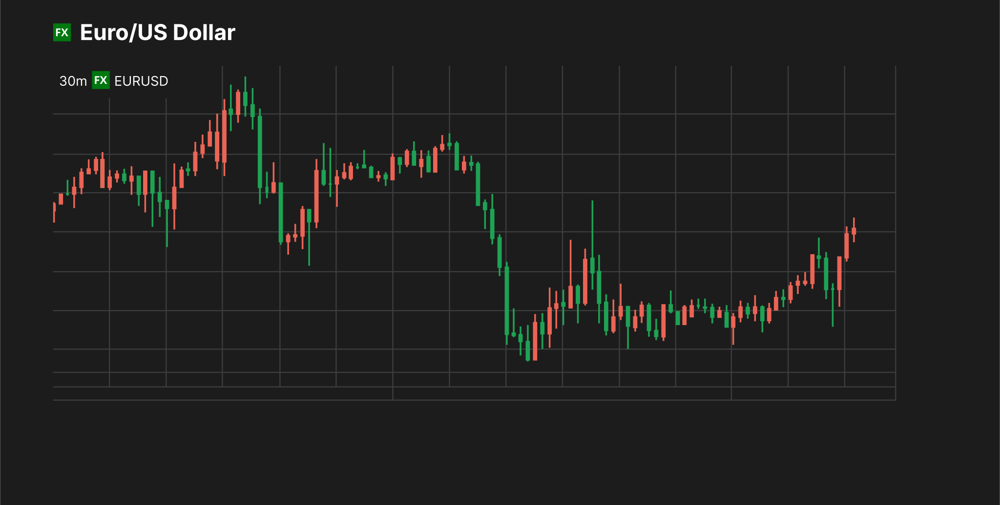

# EUR/USD Machine Learning Trading Strategy Research & Bot Development

Machine-learning research system for studying short-term EUR/USD price behaviour and generating short, hold/no-trade, or long signals from learned historical patterns. The project focuses on intraday 5-minute data, technical feature engineering, validation-based strategy selection, transaction-cost-aware evaluation, and robustness checks.

This repository is a research and backtesting project, not a guaranteed profitable trading bot or live trading system.



## Key Features

- 5-minute EUR/USD market data pipeline using OHLC price data
- Technical indicator feature engineering for momentum, volatility, trend, price structure, and time context
- Supervised 3-class ML classification for short, hold/no-trade, and long decisions
- XGBoost model training with an sklearn preprocessing pipeline
- Optuna hyperparameter tuning for model and trade-selection parameters
- Validation-based threshold and strategy selection before final test evaluation
- Session and hour-based filters for Asia, London, NY, and custom trading windows
- Cooldown/no-overlap trade logic to avoid unrealistic overlapping entries
- Transaction-cost-aware evaluation with spread/slippage assumptions
- Trading metrics including profit factor, Sharpe-like score, win rate, drawdown, average return, and trade rate
- Cost stress testing at higher transaction-cost assumptions
- Walk-forward validation for out-of-sample robustness checks
- Optional Backtrader execution-style backtest after signal validation
- Optional MLflow experiment logging for model, metrics, and artifacts

## Problem Statement

Short-term FX trading is noisy. Small price moves can be overwhelmed by spread, slippage, execution friction, and market regime changes. This project tests whether machine learning can identify small but repeatable statistical edges in EUR/USD intraday data while accounting for realistic costs and out-of-sample validation.

The goal is not to prove that a model can always predict the market. The goal is to build a disciplined research workflow for testing whether a candidate signal survives validation, cost stress, and walk-forward checks.

## How The Model Works

1. Collect EUR/USD OHLC data, primarily at the 5-minute timeframe.
2. Create technical, volatility, momentum, trend, session, and time-based features from historical price behaviour.
3. Create target labels from future returns and tradable edge assumptions: short, no-trade, or long.
4. Train a 3-class XGBoost classifier using a time-based train/validation/test split.
5. Convert model probabilities into trade candidates using confidence thresholds.
6. Filter weak signals with session, hour, direction, cooldown, and no-overlap rules.
7. Evaluate returns after estimated transaction costs.
8. Stress-test the strategy across higher costs and changing time periods.

## Methodology

### Data Collection

The notebook uses EUR/USD price data for exploratory analysis and modelling. The repository includes `data/usd-eur.xml`, plus economic calendar files in `data/economic calendar dataset/`. The notebook also references `yfinance` for research data collection.

### Feature Engineering

Features are built from OHLC price behaviour and documented in `TECHNICAL_FEATURES.md`. They include returns, candle geometry, ATR, rolling volatility, EMA/SMA trend features, MACD, ADX, RSI, Bollinger-style features, Donchian channel distances, hour, day-of-week, and session labels.

### Target Labelling

The modelling workflow creates a 3-class target:

| Class | Meaning         |
| ----- | --------------- |
| 0     | Short           |
| 1     | Hold / no trade |
| 2     | Long            |

The notebook includes ATR-aware and robust target variants that attempt to label only moves large enough to matter after estimated costs.

### Model Training

The primary model is an XGBoost classifier wrapped in an sklearn pipeline. Optuna is used to tune regularized XGBoost parameters and trade-selection settings. Time ordering is preserved so future data does not leak into earlier training periods.

### Strategy Filtering

Model probabilities are converted into trading signals only after applying confidence thresholds and execution filters. The notebook includes session filters, hour filters, direction filters, cooldown bars, and no-overlap trade logic.

### Validation And Testing

Strategy candidates are selected using validation results, then evaluated on a held-out test window. The notebook also includes threshold sweeps, monthly stability checks, cost stress tests, and expanding walk-forward validation.

### Backtesting

Backtrader is used as an optional execution-style sanity check after signals have already passed notebook-level validation. Backtrader results should be treated as secondary confirmation, not as proof of future profitability.

### Risk And Cost Assumptions

The research workflow includes estimated transaction costs, stress multipliers, micro-account constraints, and drawdown checks. These assumptions are approximations; broker-quality bid/ask data is still needed before any serious paper-trading or live-trading evaluation.

## Repository Structure

Actual repository structure:

```text
.
|-- README.md
|-- LICENSE.md
|-- TECHNICAL_FEATURES.md
|-- fx_trading_notebook.ipynb
|-- data/
|   |-- usd-eur.xml
|   |-- baseline_vs_v2_test_comparison.csv
|   |-- v2_validation_results.csv
|   |-- v2_cost_stress_results.csv
|   |-- v2_walkforward_results.csv
|   |-- v2_backtrader_summary.txt
|   |-- Asia_long_allhours_cost_stress_results.csv
|   |-- Asia_long_allhours_walkforward_results.csv
|   |-- Asia_long_allhours_backtrader_summary.txt
|   `-- economic calendar dataset/
|       |-- Calender_data.csv
|       `-- relevant_events.csv
|-- images/
|   |-- Candlestick_chart.svg
|   |-- backtrader_equity_curve.png
|   |-- Asia_long_allhours_equity_curve.png
|   |-- NY_both_equity_curve.png
|   |-- NY_both_threshold_results.csv
|   |-- NY_both_cost_stress_results.csv
|   |-- NY_both_walkforward_results.csv
|   `-- technical indicator, EDA, and validation plots
`-- mlruns/
    `-- MLflow experiment tracking output, if generated locally
```

Recommended future structure:

```text
.
|-- notebooks/
|-- data/
|-- models/
|-- reports/
|-- src/
|-- requirements.txt
`-- README.md
```

## Installation

Create and activate a virtual environment:

```bash
python -m venv .venv
source .venv/bin/activate
```

On Windows:

```powershell
.venv\Scripts\activate
```

Install dependencies:

```bash
pip install -r requirements.txt
```

Note: this repository does not currently include a `requirements.txt` file. Until one is added, install the main research dependencies manually:

```bash
pip install numpy pandas matplotlib seaborn scikit-learn xgboost optuna yfinance mlflow backtrader jupyter
```

TA-Lib may require separate system-level installation depending on your operating system.

## Usage

1. Open `fx_trading_notebook.ipynb` in Jupyter Notebook, JupyterLab, VS Code, or another notebook environment.
2. Run the dependency/import cells.
3. Run the data loading or data download cells.
4. Run the exploratory analysis and feature engineering sections.
5. Build the 3-class target labels.
6. Train the baseline XGBoost model.
7. Run the validation-based strategy selection and threshold sweep.
8. Review the final untouched test metrics.
9. Run cost stress testing and walk-forward validation.
10. Run the Backtrader section only after valid signal columns have been generated.
11. Review MLflow logs if MLflow is installed and enabled.

## Evaluation Metrics

| Metric                          | Meaning                                                                                                    |
| ------------------------------- | ---------------------------------------------------------------------------------------------------------- |
| Win rate                        | Percentage of trades with positive net return.                                                             |
| Profit factor                   | Gross gains divided by gross losses. Values above 1.0 indicate gains exceeded losses in the tested sample. |
| Sharpe-like metric              | Return consistency estimate used for strategy comparison inside the notebook.                              |
| Average net return per trade    | Mean trade return after estimated transaction costs.                                                       |
| Trade rate                      | Number or percentage of bars that produce trade signals.                                                   |
| Maximum drawdown                | Largest peak-to-trough decline in the strategy equity curve.                                               |
| Cost stress performance         | Strategy behaviour when transaction costs are multiplied above the base assumption.                        |
| Walk-forward positive fold rate | Percentage of walk-forward folds with positive out-of-sample net return.                                   |

## Example Results

Latest saved notebook outputs show mixed results. The baseline validation-selected strategy loses money on the untouched test set. V2 and V3 produce positive final-test metrics, but both are based on very small trade counts, so they should be treated as diagnostic research results rather than tradable evidence.

| Notebook result | Selected strategy | Validation status | Trades | Win Rate | Avg Net / Trade | Total Net | Profit Factor | Sharpe-like | Max Drawdown |
| --------------- | ----------------- | ----------------- | -----: | -------: | --------------: | --------: | ------------: | ----------: | -----------: |
| Baseline XGBoost | `London_long_allhours` | Passed validation gate | 110 | 41.82% | -0.000112 | -0.012350 | 0.61 | -8.49 | -1.63% |
| V2 improvement lab | `NY_short_allhours` | Passed validation gate | 4 | 50.00% | 0.000781 | 0.003124 | 19.11 | 4.76 | -0.02% |
| V3 robust target | `ALL_short_h13_14` | Failed V3 gate; diagnostic fallback | 2 | 100.00% | 0.000204 | 0.000407 | inf | 5.00 | 0.00% |

Key interpretation:

- The baseline model's final untouched test result is negative after costs, with profit factor below 1.0.
- V2 has a positive final test and positive cost-stress rows, but the final test contains only 4 trades.
- V3 has only 2 final-test trades and did not pass the multi-block validation gate, so the notebook explicitly marks it as not ready for promotion.
- Walk-forward validation is still mixed: V2 has a 60% positive fold rate but negative aggregate walk-forward net return; V3 has an 80% positive fold rate but still finishes negative in aggregate because one fold loses more than the smaller winning folds gain.
- Backtrader should be treated as a secondary execution sanity check. The saved V2 Backtrader summary moves the account from $200.00 to $204.23 over 4 trades, while an Asia-long diagnostic summary moves from $200.00 to $187.14 over 91 trades.

## Important Limitations

- Historical backtests do not guarantee future performance.
- FX spreads and slippage can erase small statistical edges.
- Short-term price prediction is noisy and regime-dependent.
- `yfinance` data may not perfectly represent broker-executable bid/ask prices.
- Notebook results can be sensitive to time period, cost assumptions, and validation design.
- The model should be paper-traded on broker-quality data before any live deployment.
- This is research code, not production trading infrastructure.
- This project is not financial advice.

## Risk Disclaimer

This project is for educational and research purposes only. It is not financial advice, investment advice, or a recommendation to trade. Trading foreign exchange involves substantial risk and may result in loss of capital.

## Roadmap

- Use longer historical EUR/USD datasets.
- Use broker-quality bid/ask data.
- Add live paper-trading mode.
- Improve walk-forward training and validation design.
- Test LightGBM/CatBoost ensembles.
- Add feature importance and model explainability.
- Add risk-based position sizing.
- Add CI checks for notebook execution.
- Package reusable code into `src` modules.
- Add a pinned `requirements.txt` or environment file.

## Author

**Author:** Eugene Maina

**Role:** Data Scientist / Quant Research Enthusiast

**Contact** : [Email](eugenemaina72@gmail.com) | [GitHub](https://github.com/eugene-maina72) | [LinkedIn](https://www.linkedin.com/in/eugene-maina-4a8b9a128/)
