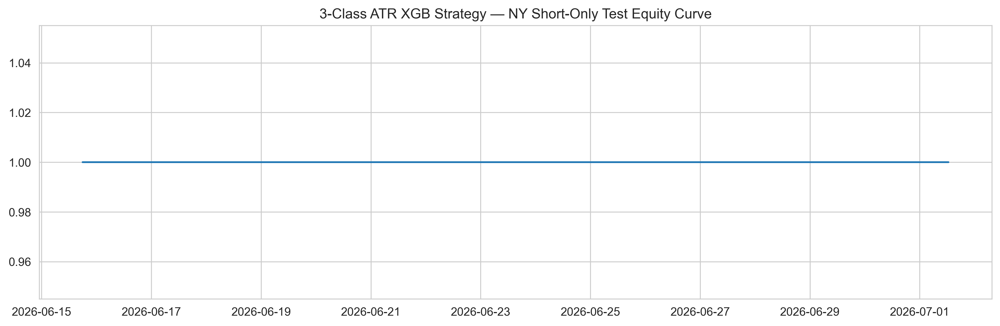

# FX Trading Bot - EUR/USD

Research notebook for building and validating a systematic EUR/USD intraday trading strategy. The project focuses on 5-minute data, technical features, session behavior, confidence-ranked XGBoost signals, and out-of-sample trading validation.

## Current Status

This repository is in research mode, not production trading mode.

The latest local workflow moved from a single XGBoost train/test result into a validation framework for testing whether a session-filtered edge is real. Current artifacts show that some validation/test variants can produce interesting trade-level behavior, but the strategy does not yet survive robustness checks strongly enough for live capital.

Notable current findings:

- The notebook uses a 3-class ATR-aware target: `0 = Short`, `1 = No Trade`, `2 = Long`.
- Trade entries are selected by confidence ranking rather than naive argmax classification.
- Final strategy candidates are evaluated only on validation, held-out test, or walk-forward out-of-sample windows.
- Cost stress is a major weakness: the current `NY_both` test artifact has profit factor below 1.0 at 1x cost and degrades further at 1.5x-2.0x cost.
- Walk-forward results are mixed, so the model is not yet stable enough for deployment.
- Backtrader execution checks should be treated as secondary confirmation after notebook signal validation, not as the primary proof of edge.

## Main Notebook

- `fx_trading_notebook_robust_ordered.ipynb` - current ordered research notebook.

The notebook follows this workflow:

1. Business and risk framing for a small EUR/USD account.
2. Data understanding across 5-minute, 1-minute, daily, and economic-calendar data.
3. Technical analysis feature engineering and session context.
4. ATR-aware 3-class target creation.
5. Leakage-safe stationary feature selection.
6. Time-based train/test split with preprocessing pipeline.
7. XGBoost 3-class model tuning with Optuna.
8. Validation-based strategy selection and fixed-cutoff test evaluation.
9. Threshold sweep, monthly stability, cost stress, and walk-forward validation.
10. Backtrader execution sanity check.
11. MLflow logging of the full sklearn pipeline.

## Repository Structure

- `fx_trading_notebook_robust_ordered.ipynb` - end-to-end research workflow.
- `TECHNICAL_FEATURES.md` - indicator and feature documentation.
- `data/`
  - `usd-eur.xml` - historical EUR/USD data used by the notebook.
  - `economic calendar dataset/` - calendar/event data for news overlays.
- `images/` - generated plots and validation artifacts.
  - `ny_short_only_equity_curve.png` - NY short-only equity curve artifact.
  - `NY_both_threshold_results.csv` - confidence threshold sweep results.
  - `NY_both_cost_stress_results.csv` - transaction-cost stress results.
  - `NY_both_walkforward_results.csv` - walk-forward validation results.
  - `Asia_long_allhours_*` - validation artifacts for the selected Asia long-only experiment.
- `mlruns/` - MLflow experiment tracking output.

## Key Validation Artifacts

Current local artifacts include:

- `images/NY_both_threshold_results.csv`
- `images/NY_both_cost_stress_results.csv`
- `images/NY_both_walkforward_results.csv`
- `images/Asia_long_allhours_validation_threshold_results.csv`
- `images/Asia_long_allhours_cost_stress_results.csv`
- `images/Asia_long_allhours_walkforward_results.csv`
- `images/Asia_long_allhours_backtrader_summary.txt`

The latest Backtrader summary for `Asia_long_allhours` starts with a $200 account and ends around $189.56, so it is evidence against production readiness in its current form.

## Research Guardrails

- Do not train on raw forward returns or target columns.
- Do not include raw OHLCV columns as model features.
- Do not report full-dataset backtests as final performance.
- Keep final metrics test-only or walk-forward out-of-sample.
- Treat classification metrics as secondary; trading metrics and robustness checks matter more.
- Stress all promising results with higher spreads, slippage, and walk-forward validation.

## Next Experiments

- Add more historical EUR/USD 5-minute data before trusting any session-specific edge.
- Compare NY short-only, NY both-direction, and Asia long-only under the same validation protocol.
- Require survival at 1.5x and 2.0x transaction costs before promoting a strategy.
- Add spread/slippage simulation around high-impact news.
- Paper trade the best candidate on broker-quality data before considering automation.
